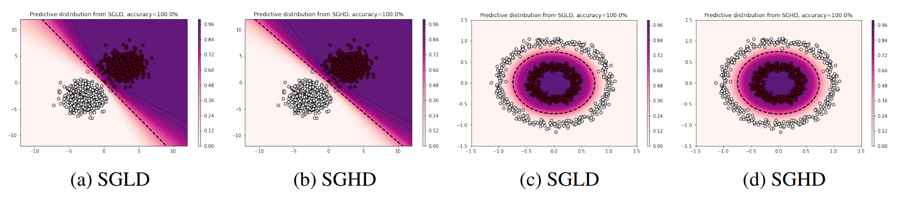
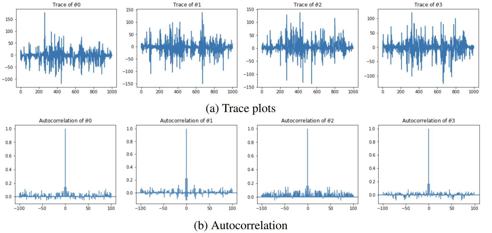

# Bayesian ML : Project about the paper "Bayesian Learning via Stochastic Gradient Langevin Dynamics" written by Max Welling and Yee Whye Teh.

**Students** : Amal Chaoui and Narjisse Lasri

This github repository presents the work done on the Bayesian Machine Learning project about the article ["Bayesian Learning via Stochastic Gradient Langevin Dynamics"](https://www.stats.ox.ac.uk/~teh/research/compstats/WelTeh2011a.pdf) (SGLD) written by Max Welling and Yee Whye Teh.

It is composed of 6 files about the article, its application to data and our contribution.
 - BML_project_Chaoui_Lasri.pdf : PDF report explaining the contents of the paper, emphazing the strong and weak points of the paper, showing the results of the application of SGLD to real data and presenting our contribution.
 - sgld.py, sgld_toy.ipynb : Application of SGLD to linear and circular synthetic data. The notebook describes the implementation and the results. The python file contains the functions run in the notebook.
 - sghd.py, sghd_toy.ipynb : Application of our contribution (Stochastic Gradient Hamiltonian Dynamics) to linear and circular synthetic data. The notebook describes the implementation and the results. The python file contains the functions run in the notebook.
 - sgld_sghd_real_dataset.ipynb : Application of SGLD and SGHD to real data. We use a bank marketing dataset consisting of data (17 features) collected from 11162 customers by a Portuguese banking institution. The classification goal is to predict whether the client will subscribe to a term deposit after a phone call marketing advertisement.
 
**Dependencies** : To run these files, it is necessary to have the libraries numpy, matplotlib, sklearn, scipy, tqdm, copy, time, pymc3. 

**Some results** : 

Figure 1 : Decision boundaries obtained by SGLD and SGHD for different classification tasks

  

Figure 2 : Trace plots of the parameters of θ obtained using SGLD for the linearly separable classes 

  

Figure 3 : Trace plots of the parameters of θ obtained using SGHD for the linearly separable classes 

  

Thanks to our contribution, we can observe that SGHD improves the mixing behavior and decorrelates the chain moves.

